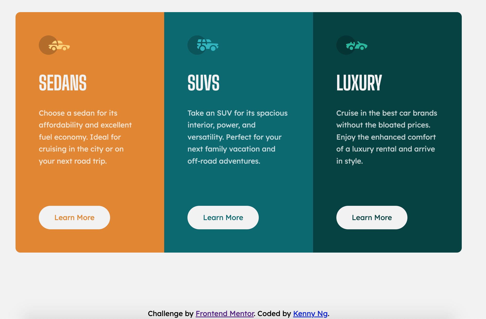
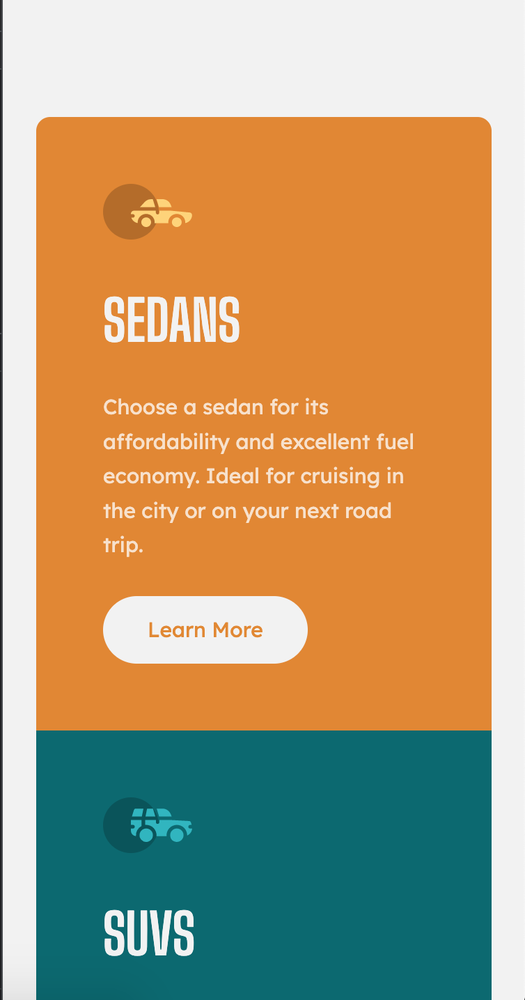

# Frontend Mentor - 3-column preview card component solution

This is a solution to the [3-column preview card component challenge on Frontend Mentor](https://www.frontendmentor.io/challenges/3column-preview-card-component-pH92eAR2-). Frontend Mentor challenges help you improve your coding skills by building realistic projects.

## Table of contents

- [Overview](#overview)
  - [The challenge](#the-challenge)
  - [Screenshot](#screenshot)
  - [Links](#links)
- [My process](#my-process)
  - [Built with](#built-with)
  - [What I learned](#what-i-learned)
  - [Useful resources](#useful-resources)
- [Author](#author)


## Overview

### The challenge

Users should be able to:

- View the optimal layout depending on their device's screen size
- See hover states for interactive elements

### Screenshot

<p>Desktop version</p>

<p>Mobile version</p>



### Links

- Solution URL: [https://www.frontendmentor.io/solutions/responsive-3-column-preview-card-using-grid-tmTvMBDTl0](https://www.frontendmentor.io/solutions/responsive-3-column-preview-card-using-grid-tmTvMBDTl0)
- Live Site URL: [https://kennylun123.github.io/fm-3-column-preview-card-component/](https://kennylun123.github.io/fm-3-column-preview-card-component/)

## My process

### Built with

- Semantic HTML5 markup
- CSS custom properties
- Flexbox
- CSS Grid
- Mobile-first workflow
- CUBE CSS

### What I learned

- CUBE methodology
- CSS property transition
```
transition: background-color 200ms ease-in-out, color 200ms ease-in-out;
```
- I found that using `grid-template-rows: 1fr 1fr 1fr;` will share equal amount of width for each item. In this situation, it is better than using `flex-direction: row;`.

### Useful resources

- [CUBE CSS blog by Andy bell](https://andy-bell.co.uk/cube-css/)

## Author

- Website - [Kenny Ng](https://www.github.com/kennylun123)
- Frontend Mentor - [@kennylun123](https://www.frontendmentor.io/profile/kennylun123)
